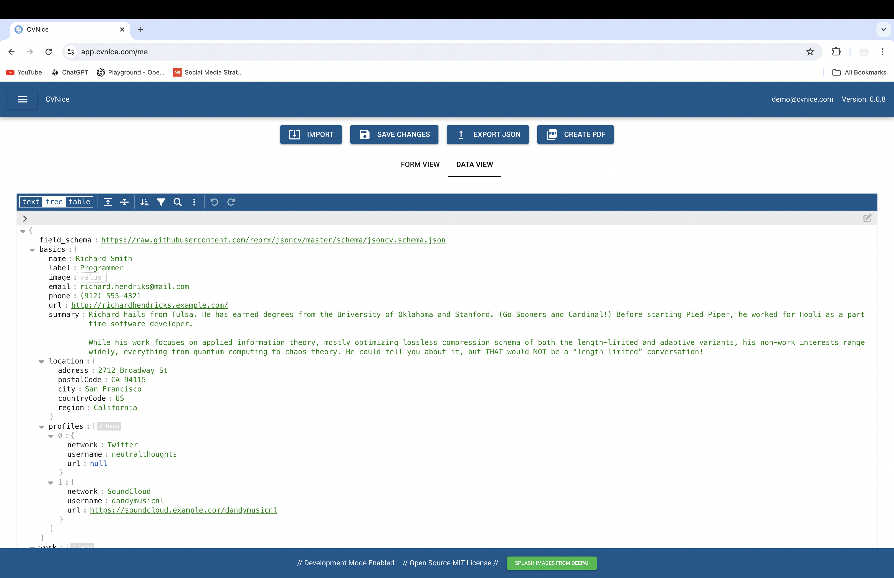
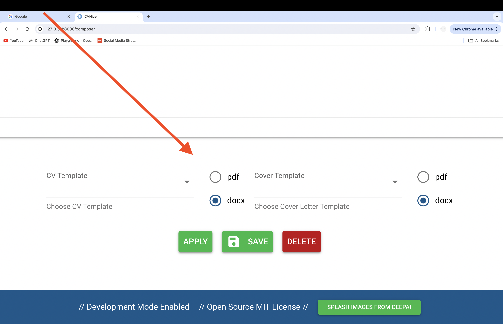

Welcome to the help page for CVNice. The home section serves to briefly describe the purpose of our application.

The drop down menu can be found by clicking the navbar icon in the upper left portion of the web page. Here, you can navigate to other sections of our app.

Here is the CV creation page where you can fill out the forms that help to build an accurate representation of your skills in your CV.

Also, there is the option to interact within the JSON view.

This section is where you can both paste in, store and apply to jobs but also generate custom CVs and cover letters.

Below the Job Opportunities/Leads section is the 'Leads' section where you can see any selected opportunities and specific details

At the bottom of this page and below your selected job opportunity is the option to generate/download a CV/Cover Letter in either DOCX or PDF format.

The Templates section allows the user to upload their own CV/Cover Letter templates. If the user does not define/upload their own templates then they will receive a default template.

Within the settings page you are able to toggle between normal and dark modes, giving users control over the visual aesthetic based on personal preference.

The login page allows visitors to either sign up, sign in or change password if forgotten.
